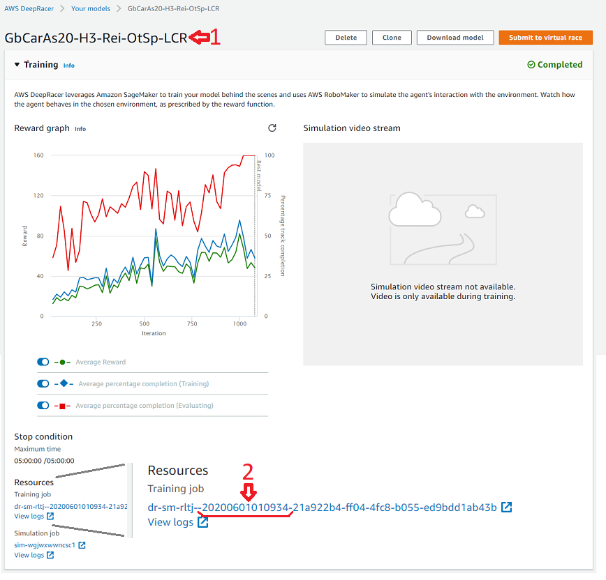
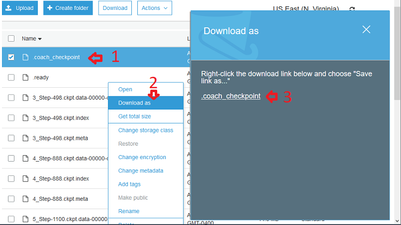

# Copy pre-trained AWS DeepRacer model to a diff account

If you have multiple accounts AWS accounts or for some reason you need
to copy your pre-trained model to a different account, this document
attempts to giude you.

We will refer the account where pre-trained model is already present as source-account and another account to which you would like to copy the model to as target-account

## Step#0: Temperory Local Directory (Folder)
In your local system, create a new empty directory where we can download and store files from S3. I would recommend to name the directory with same the name as your source model. Within this directory create following directory structure 
<pre>
TEMP-MODEL-DIR
    |- model-files
</pre>

## Step#A1: Login to source account

Login into AWS Deep Racer console source-account. 

## Step#A2 Source model key info

To locate the key files for your source model, we need two pecies of information

1. Model Name
This can be found at top of the model details page

2. Model training/creation timestamp
To find the timestamp, expand the "Training" section if it is collapsed and you can find the timestamp in "Resources" section. Note this is Training timestamp and not Evaluation

## Step #A3 Download S3 files to local directory

### Source S3 folders

DeepRacer S3 bucket is named with pattern `aws-deepracer-xyz`. Open browser tab with AWS S3 URL [https://s3.console.aws.amazon.com] and go into your DeepRacer S3 bucket. We are interested in below three directories but most important one is DeepRacer-SageMaker-RoboMaker-comm-TIMESTAMP (note the timestamp we noted may differ by last few characters here).

<pre>
aws-deepracer-azslk243-a42...ok0
 |- model-metadata
 |  |- #MODEL-NAME
 |     |- model_metadata.json
 |- reward-functions
 |  |- #MODEL-NAME
 |     |- reward_function.py
 |- DeepRacer-SageMaker-RoboMaker-comm-TIMESTAMP-2004270...8c2e
    |- model
       |- #all--files-in-here
</pre>

### Download to local directory
1. `model-metadata/#MODEL-NAME/model_metadata.json` to `TEMP-MODEL-DIR`  : Contains model's action space definition. (copy of same is also present in `DeepRacer-SageMaker-RoboMaker` directory)
2. `reward-functions/#MODEL-NAME/reward_function.py` to `TEMP-MODEL-DIR` : Contains reward function you used for training your model. 
3.`DeepRacer-SageMaker-RoboMaker-comm-TIMESTAMP-2004270...8c2e/model/*` to `TEMP-MODEL-DIR/model-files`: Contains multiple files that define trained model we are interested to copy over.

**Note:** Downloading multiple files from a directory is not supported by S3. To speed up the process, for each file `RightClick > Download As` and then on the file link on right, `RightClick > Save Link As` helps to speed up the process.

## Step #A4: Log out of source account

Now that we have downloaded necessary files, logout of source-account. 

## Step #B1: Login to target account

Login into AWS Deep Racer console target-account. 

## Step#B2: Create dummy model in target account
In your target account, create a new dummy placeholder model with same name as model in source account and train it for minimum allowed time (5 min). It does not matter which car you choose or what reward function you have. This information will be overwritten with files from source account. To speed up the process, you can do this step in advance in a separate browser as placeholder model training will take approx 15-20 mins to complete.

Similar to **Step#A2** locate key info (model name and timestamp) for new placeholder model in target account which will help us to naviate our S3 bucket here.

## Step #B3: Delete and overwrite target model files

**CAUTION:** This is a dangerous step as you may by mistake delete or overwrite wrong files and/or directories so be very meticulous.

Open browser tab with AWS S3 URL [https://s3.console.aws.amazon.com] and go into your DeepRacer S3 bucket (`aws-deepracer-xyz`). Locate respective directories in S3 and delete placeholder model files and upload files from source model that we had downloaded to our local system.

1. `TEMP-MODEL-DIR/model_metadata.json`  to `model-metadata/#MODEL-NAME` : Copy of this file is also in `DeepRacer-SageMaker-RoboMaker` directory
2. `TEMP-MODEL-DIR/reward_function.py` to `reward-functions/#MODEL-NAME` : You can skip this file as we are not planning to train any further with this reward function. 
3. `TEMP-MODEL-DIR/model-files/*` to `DeepRacer-SageMaker-RoboMaker-comm-TIMESTAMP-2004270...8c2e/model`: Make sure you delete all the files before you upload as file names here are different

## Step #C
At this point we have replaced the placeholder model in target account with the model that we needed from source account. You can see the action space (from `model_metadata.json`) and reward function (from reward_function.py) now shows on target model's detials page. 

Go ahead and evaluate the model to verify it is working as expected. I have observed some degradation of few hundred milli seconds after this process. Not sure if this is due to some missed files or is an expected behaviour.

# Enjoy your ride ... VrrrrrooOOOOooommm VrrrrrooOOOOooommm

